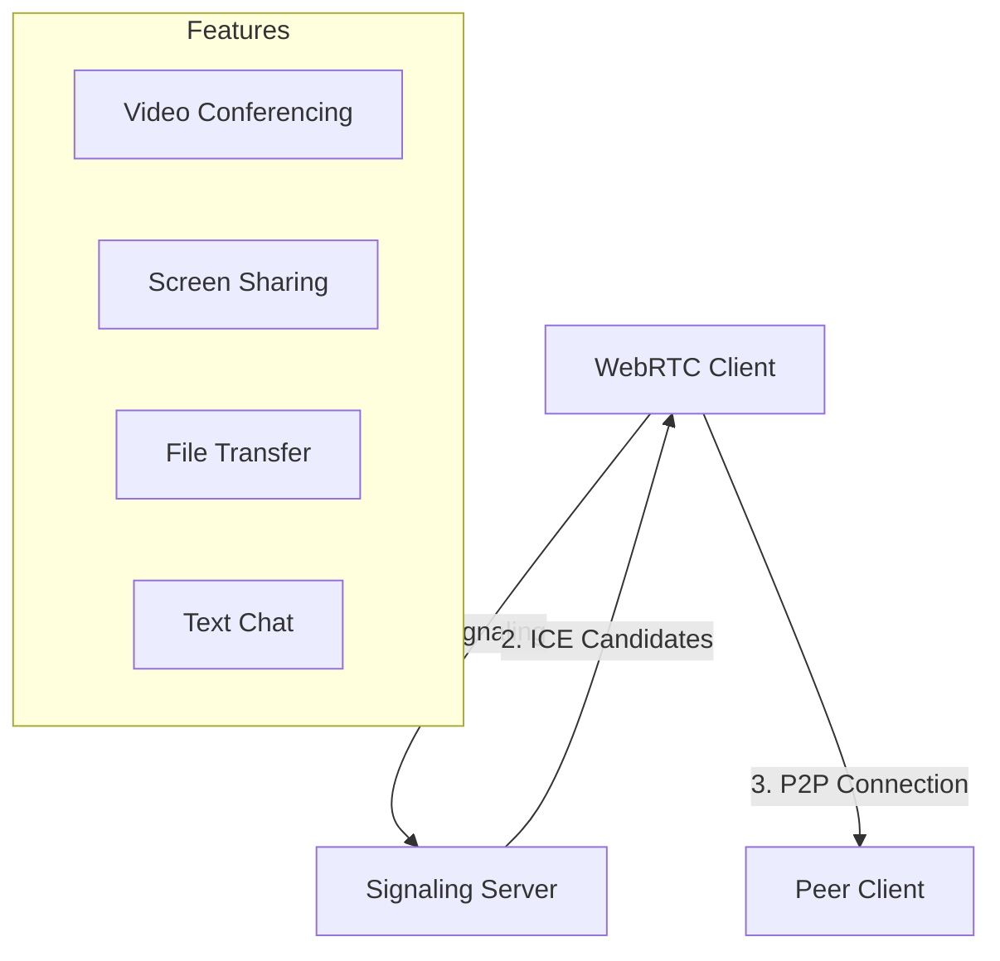
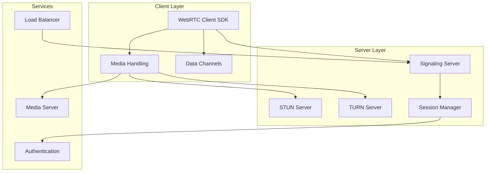
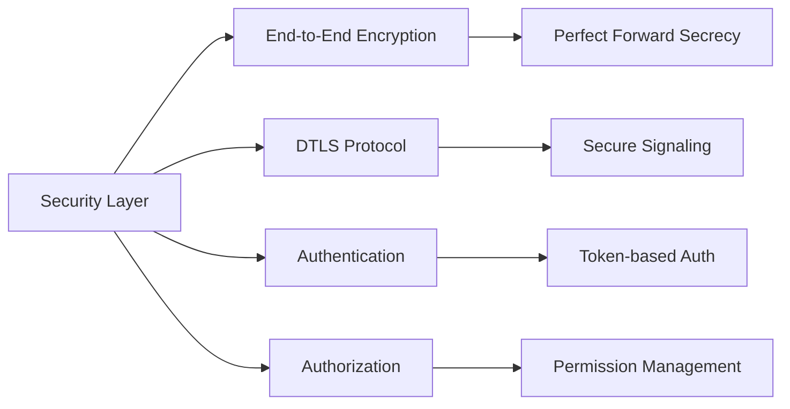
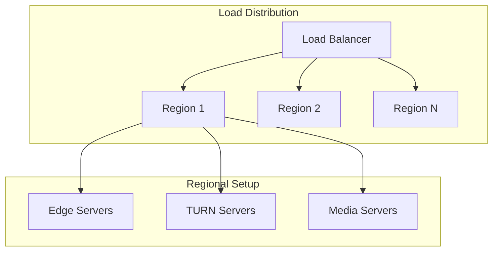
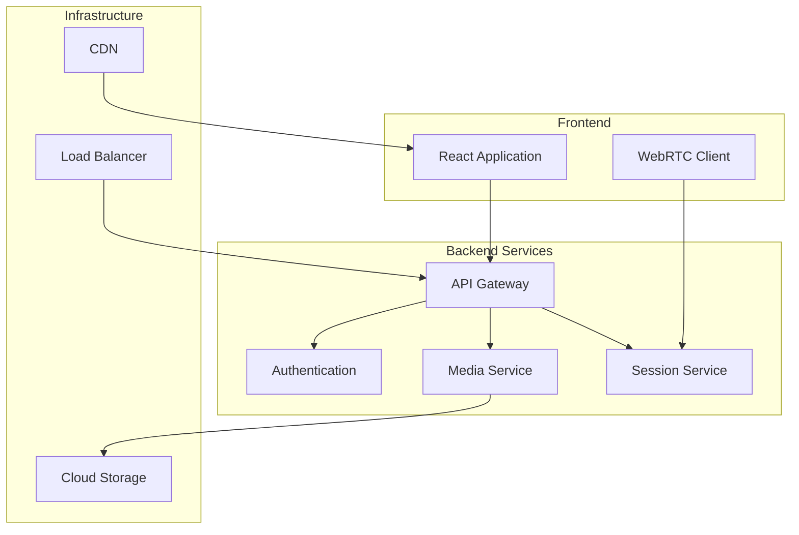
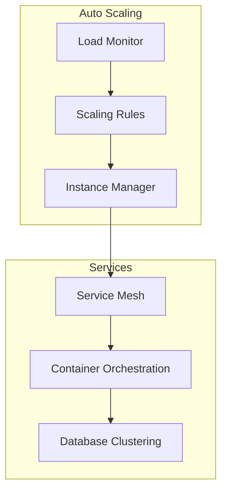
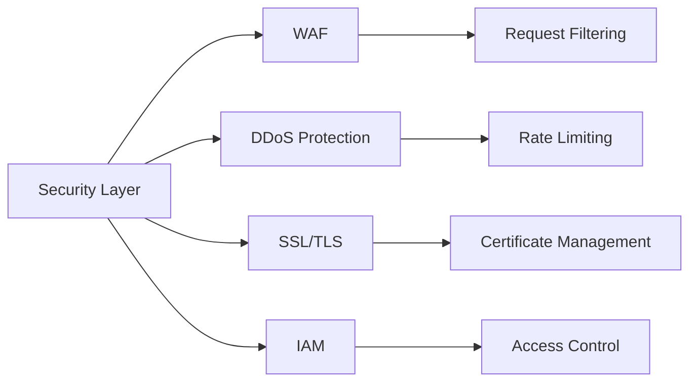
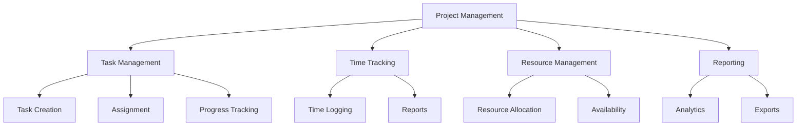
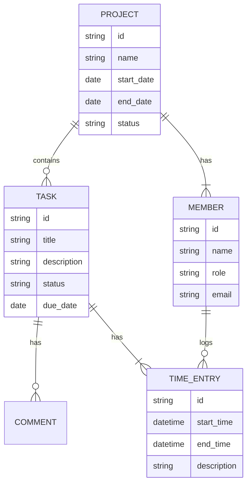
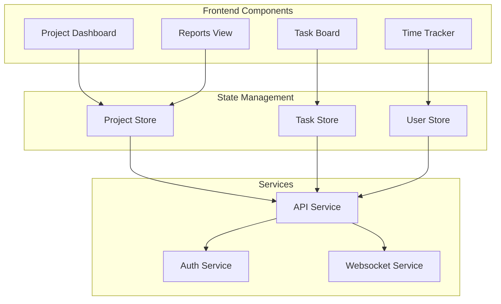

# System Architecture Documentation

## 1. WebRTC Implementation Strategy

### Real-time Communication Features



#### Core Features
- Multi-party video conferencing
- Screen sharing and remote desktop
- File sharing during sessions
- Real-time text chat
- Recording capabilities

### WebRTC Architecture Components



#### Component Details
1. **Client SDK**
   - WebRTC API abstraction
   - Connection management
   - Media stream handling

2. **Server Components**
   - STUN/TURN servers for NAT traversal
   - Signaling server (WebSocket-based)
   - Session management service

3. **Supporting Services**
   - Load balancer for scaling
   - Media processing server
   - Authentication and authorization

### Security Considerations



- End-to-end encryption for all communications
- DTLS-SRTP for media streams
- Token-based authentication
- Permission-based room access
- Rate limiting and DDoS protection

### Scalability Approach



- Multi-region deployment
- Automatic scaling based on load
- Geographic distribution of TURN servers
- Load balancing across regions

## 2. Deployment Infrastructure

### Server Architecture



#### Core Components
1. **Frontend Layer**
   - React/TypeScript application
   - WebRTC client implementation
   - State management (Redux/Zustand)

2. **Backend Services**
   - API Gateway for request routing
   - Session management service
   - Media processing service
   - Authentication service

3. **Infrastructure**
   - Load balancers (Layer 4 and 7)
   - Content Delivery Network
   - Object storage for media

### Scaling Strategy



- Horizontal scaling of services
- Auto-scaling based on metrics
- Regional deployment strategy
- Database sharding for scalability

### Security Measures



- Web Application Firewall (WAF)
- DDoS protection
- SSL/TLS encryption
- Identity and Access Management (IAM)
- Regular security audits

## 3. Project Management Tools Structure

### Core Features



### Data Model



### API Endpoints Structure

```mermaid
graph TD
    subgraph Projects API
        A[/api/projects]
        B[/api/projects/{id}]
        C[/api/projects/{id}/tasks]
    end
    
    subgraph Tasks API
        D[/api/tasks]
        E[/api/tasks/{id}]
        F[/api/tasks/{id}/comments]
    end
    
    subgraph Time API
        G[/api/time-entries]
        H[/api/reports/time]
    end
    
    subgraph Users API
        I[/api/users]
        J[/api/teams]
    end
```

### Component Architecture



## Implementation Notes

1. **Phase 1: Core Infrastructure**
   - Set up basic WebRTC infrastructure
   - Implement authentication system
   - Deploy basic project management features

2. **Phase 2: Scaling & Security**
   - Implement multi-region support
   - Add security measures
   - Set up monitoring and logging

3. **Phase 3: Advanced Features**
   - Add recording capabilities
   - Implement advanced project management features
   - Add analytics and reporting

4. **Phase 4: Optimization**
   - Performance optimization
   - UX improvements
   - Security hardening