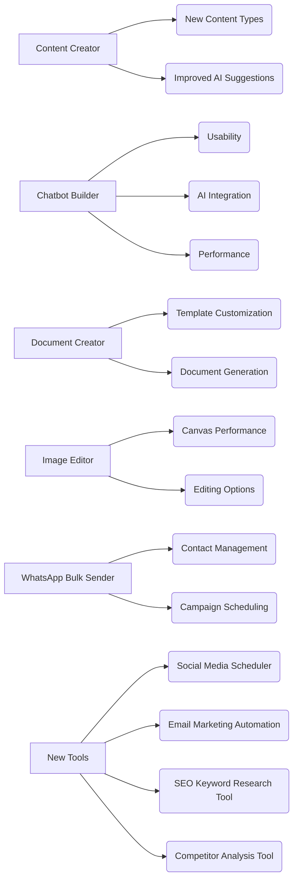

# Improvements Plan

## I. Content Creator Improvements (Highest Priority)

*   **New Content Types:**
    *   Email Subject Lines: Add a new content type specifically for generating catchy and effective email subject lines.
    *   Ad Copy: Add content types for various ad platforms (Google Ads, Facebook Ads, etc.) with specific character limits and best practices.
    *   Website Landing Pages: Add a content type for generating landing page copy, including headlines, body text, and calls to action.
*   **Improved AI Suggestions:**
    *   Blog Posts: Improve prompt suggestions to help users generate more engaging and informative blog post content.
    *   Social Media Posts: Tailor prompt suggestions to different social media platforms (Twitter, Facebook, Instagram, etc.) and content formats (text, images, videos).
    *   Product Descriptions: Enhance prompt suggestions to help users create compelling and persuasive product descriptions that highlight key features and benefits.

## II. Other Tool Improvements

*   **Chatbot Builder:**
    *   Usability: Improve the node editing interface to make it more intuitive and user-friendly.
    *   AI Integration: Enhance AI integration to allow for more dynamic and personalized chatbot responses.
    *   Performance: Optimize the chatbot builder to handle larger and more complex chatbot flows.
*   **Document Creator:**
    *   Template Customization: Allow users to customize existing templates or create their own templates from scratch.
    *   Document Generation: Improve the document generation process to produce more professional and polished documents.
*   **Image Editor:**
    *   Canvas Performance: Optimize the canvas to handle larger images and more complex designs without lag.
    *   Editing Options: Add more editing options, such as advanced filters, layer effects, and text manipulation tools.
*   **WhatsApp Bulk Sender:**
    *   Contact Management: Improve contact management features, such as importing contacts from CSV files and segmenting contacts into lists.
    *   Campaign Scheduling: Add campaign scheduling features to allow users to schedule messages to be sent at specific times.

## III. New Tools to Implement

*   Social Media Scheduler: A tool that allows users to schedule social media posts across multiple platforms.
*   Email Marketing Automation: A tool that allows users to create and automate email marketing campaigns.
*   SEO Keyword Research Tool: A tool that helps users identify relevant keywords for their content.
*   Competitor Analysis Tool: A tool that allows users to analyze their competitors' websites and marketing strategies.

## Mermaid Diagrams



```mermaid
graph LR
    subgraph Content Creator
        A[New Content Types] --> A1(Email Subject Lines)
        A --> A2(Ad Copy)
        A --> A3(Website Landing Pages)
        B[Improved AI Suggestions] --> B1(Blog Posts)
        B --> B2(Social Media Posts)
        B --> B3(Product Descriptions)
    end
    
    subgraph Other Tools
        C[Chatbot Builder]
        D[Document Creator]
        E[Image Editor]
        F[WhatsApp Bulk Sender]
    end

    subgraph New Tools
        G[Social Media Scheduler]
        H[Email Marketing Automation]
        I[SEO Keyword Research Tool]
        J[Competitor Analysis Tool]
    end